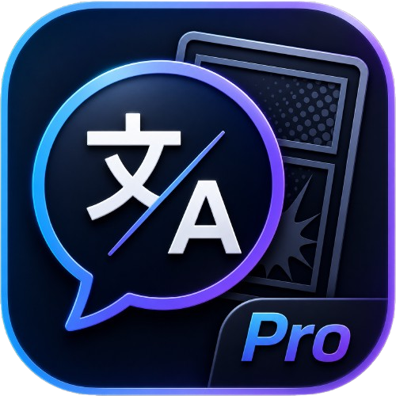

## languages

- java
- javascript
rest are too hard fuck no

---

## Main Project

### BallonsTranslator-Pro

A customized and improved translation/editing workflow for manga, comics, images, and related media.

Things I care about in this project:

- Better UI and workflow
- Cleaner setup and configuration
- Better review tools
- Faster setup for AI/LLM modules
- Practical fixes that users actually notice

---

